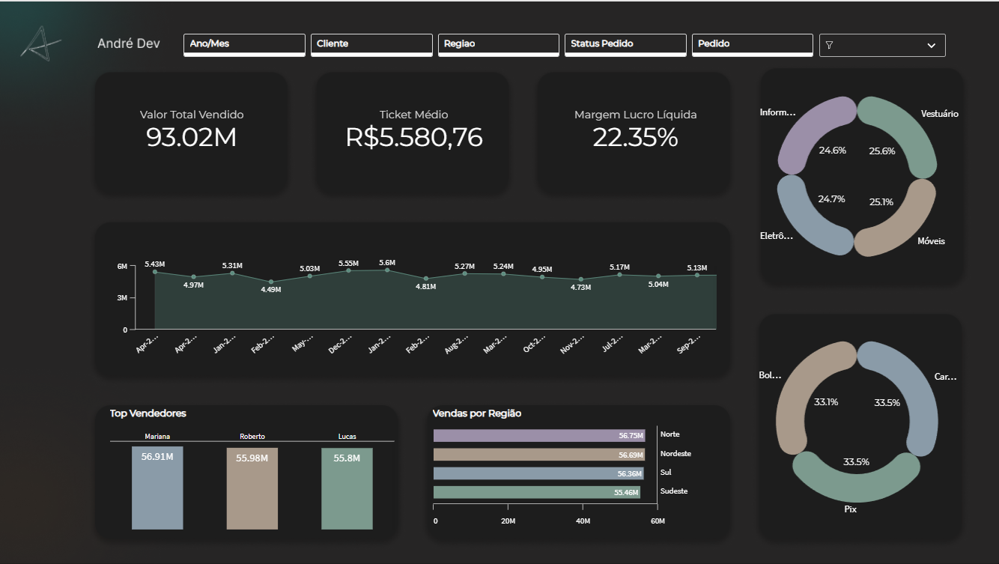

# Dashboard de Vendas — Análise Comercial com Qlik Sense

> Painel analítico interativo construído no Qlik Sense para análise completa de performance comercial, com dataset sintético de 50.000 registros de vendas simulando um ambiente real de varejo.

---

## Preview



---

##  Objetivo

Construir um painel executivo de vendas capaz de responder as principais perguntas de negócio de uma operação comercial:

- Qual é o **faturamento total** e a **margem de lucro** no período?
- Quais **regiões** e **categorias** geram mais receita?
- Quem são os **top vendedores** e como evoluíram ao longo do tempo?
- Qual **forma de pagamento** predomina nas transações?
- Como o **volume de vendas** se comporta mês a mês?

---

## KPIs e Indicadores

| Indicador | Descrição |
|-----------|-----------|
| **Valor Total Vendido** | Receita bruta consolidada no período |
| **Ticket Médio** | Valor médio por transação |
| **Margem de Lucro Líquida** | Percentual médio de lucro estimado |
| **Top Vendedores** | Ranking por volume de vendas |
| **Vendas por Região** | Distribuição geográfica da receita |
| **Vendas por Categoria** | Share por linha de produto |
| **Vendas por Tipo de Pagamento** | Preferência de meio de pagamento |

---

##  Estrutura do Repositório

```
dashboard-vendas-qlik/
├── README.md
├── assets/
│   ├── dashboard.png        ← print do painel principal
└── script/
    └── load_script.qvs      ← script de carga e modelagem
```

---

## Script de Carga — Como Funciona

O dado foi gerado sinteticamente diretamente no Qlik Sense via `AutoGenerate`, simulando 50.000 registros de vendas com distribuição aleatória controlada.

```qlik
// Geração de 50.000 registros sintéticos
LET vTotalLinhas = 50000;

Vendas_Temp:
LOAD
    RecNo()                                                                      as ID_Venda,
    'CLI-' & Text(Num(Floor(Rand() * 1000) + 1, '0000'))                         as ID_Cliente,
    Date(Floor(MakeDate(2025, 1, 1) + Rand() * 550))                             as Data_Venda,
    Pick(Ceil(Rand() * 5), 'Sul', 'Sudeste', 'Norte', 'Nordeste', 'Centro-Oeste') as Regiao,
    Pick(Ceil(Rand() * 4), 'Eletrônicos', 'Móveis', 'Vestuário', 'Informática')  as Categoria,
    Pick(Ceil(Rand() * 3), 'Pix', 'Cartão de Crédito', 'Boleto')                as Forma_Pagamento,
    Pick(Ceil(Rand() * 5), 'Carlos', 'Mariana', 'Roberto', 'Fernanda', 'Lucas') as Vendedor,
    Pick(Ceil(Rand() * 3), 'Concluído', 'Pendente', 'Cancelado')                as Status_Pedido,
    Floor(Rand() * 10) + 1                                                      as Qtd_Itens,
    Round(Rand() * 2000 + 20, 0.01)                                             as Valor_Unitario,
    Round(Rand() * 0.35 + 0.05, 0.01)                                           as Margem_Pct
AutoGenerate $(vTotalLinhas);

// Cálculo dos indicadores derivados
Vendas:
LOAD
    ID_Venda, ID_Cliente, Data_Venda,
    Year(Data_Venda)                                             as Ano,
    Month(Data_Venda)                                            as Mes,
    Dual(Text(Date(Data_Venda, 'MMM-YYYY')),
         AutoNumber(MonthStart(Data_Venda)))                     as AnoMes,
    Regiao, Categoria, Forma_Pagamento, Vendedor, Status_Pedido,
    Qtd_Itens, Valor_Unitario,
    Round(Qtd_Itens * Valor_Unitario, 0.01)                      as Valor_Total,
    Margem_Pct,
    Round((Qtd_Itens * Valor_Unitario) * Margem_Pct, 0.01)      as Lucro_Estimado
RESIDENT Vendas_Temp;

DROP TABLE Vendas_Temp;
```

---

##  Decisões Técnicas

**Por que dataset sintético?**
A geração via `AutoGenerate` com `Rand()` permite simular distribuições realistas sem depender de dados sensíveis. Com 50.000 registros, o painel responde de forma fluida mesmo com múltiplos filtros ativos simultâneos.

**Modelagem em duas etapas:**
A separação entre `Vendas_Temp` (dados brutos) e `Vendas` (dados tratados) segue a boa prática de transformação em camadas — equivalente ao padrão Bronze → Silver em pipelines de dados modernos.

**Campos derivados calculados na carga:**
`Valor_Total` e `Lucro_Estimado` são calculados no script de carga, não em expressões de gráfico — isso melhora a performance do painel e mantém a lógica de negócio centralizada.

---

##  Filtros Disponíveis no Painel

- **Ano/Mês** — seleção temporal
- **Cliente** — filtro por ID de cliente
- **Região** — Sul, Sudeste, Norte, Nordeste, Centro-Oeste
- **Status do Pedido** — Concluído, Pendente, Cancelado
- **Pedido** — busca por ID de venda

---

## Principais Insights do Dataset

- As **4 categorias** (Eletrônicos, Móveis, Vestuário, Informática) têm distribuição equilibrada (~25% cada), indicando ausência de sazonalidade forçada
- Os **3 meios de pagamento** têm share quase igual (~33% cada) — típico de varejo online diversificado
- A **curva de vendas mensais** não apresenta queda brusca, evidenciando estabilidade operacional simulada
- Os **top 3 vendedores** (Mariana, Roberto, Lucas) têm volumes muito próximos, sugerindo equipe homogênea

---

## Tecnologias Utilizadas


---

## Autor

**André Felipe dos Santos Ricardo**

Data & System Analyst | Joinville, SC

[](https://www.linkedin.com/in/itsandrezl/)
[](https://github.com/itsandrezl)
[](https://itsandrezl.github.io)
